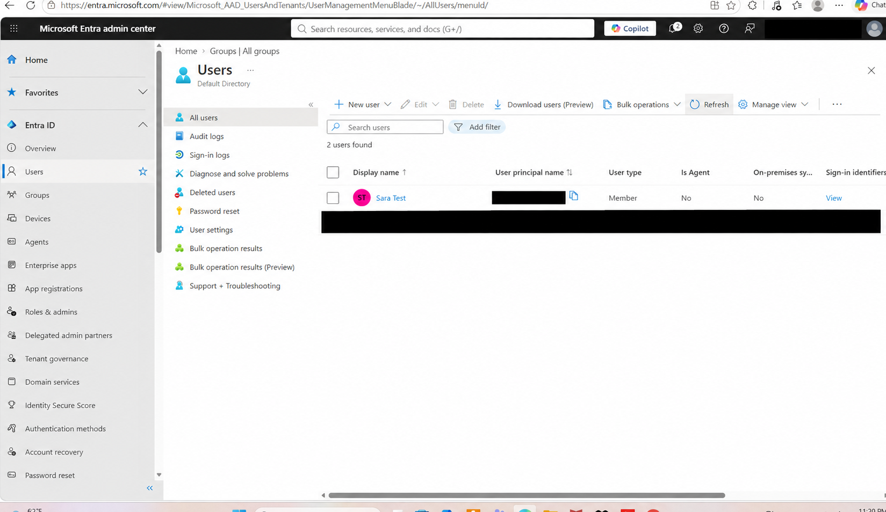
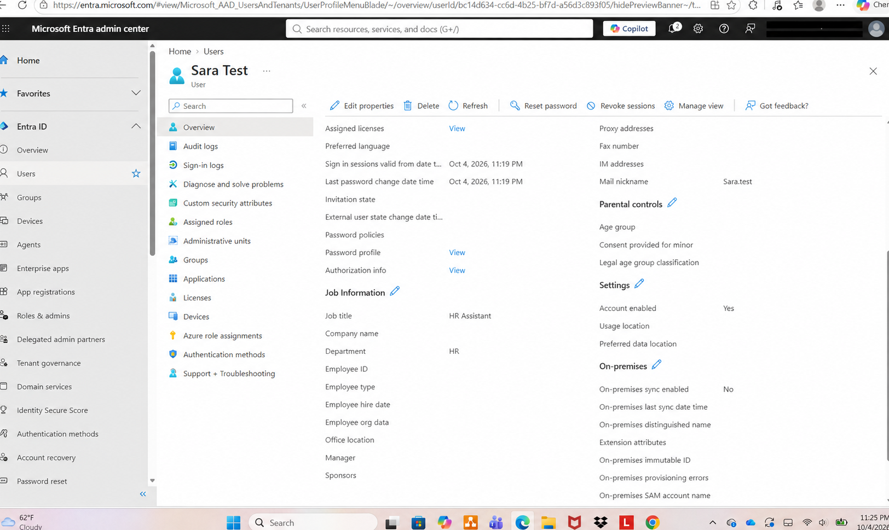
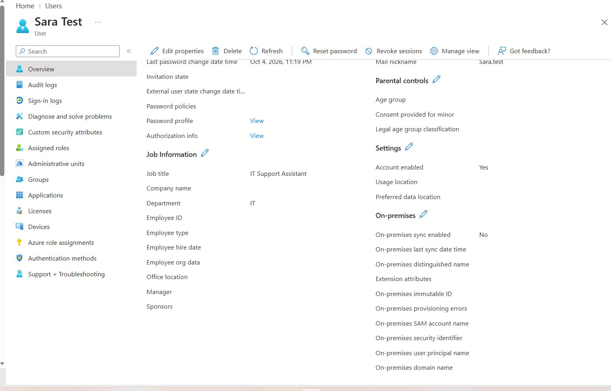
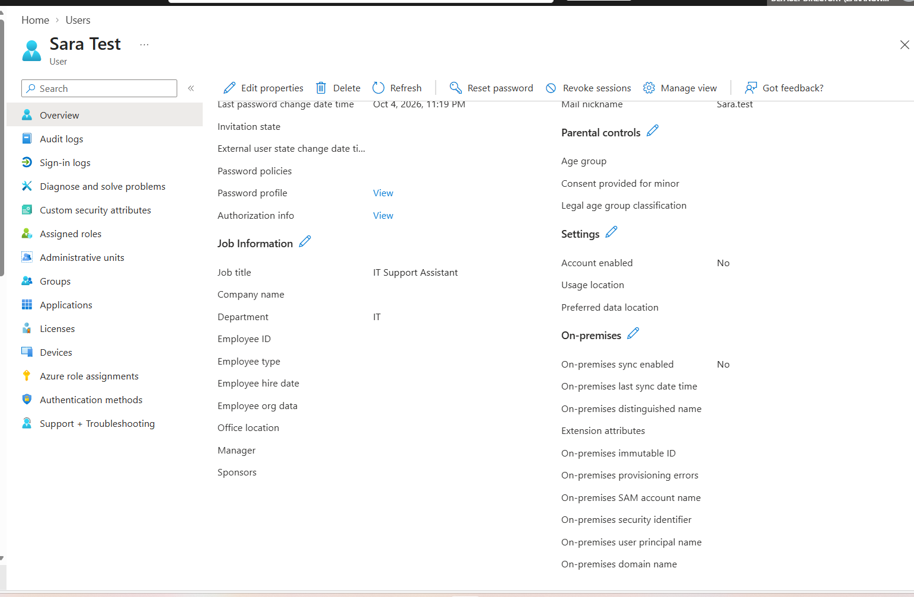
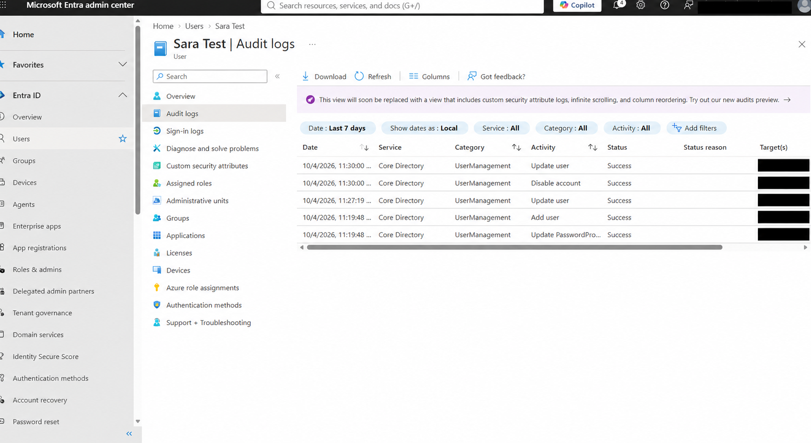
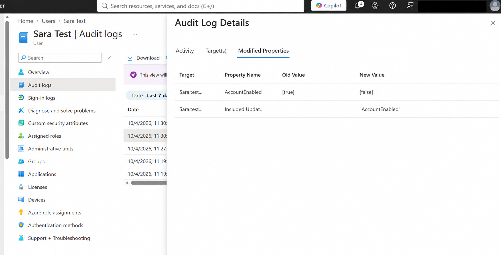
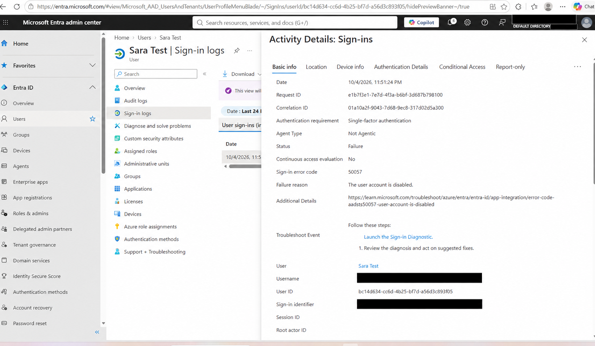

# Microsoft Entra ID — User Lifecycle Lab

## Overview
This hands-on IAM lab simulates an employee joining a company, changing departments, and leaving. I created a test user, updated their profile, disabled their account, and checked audit and sign-in logs.

## Tools
- Microsoft Entra admin center
- Personal Microsoft Entra tenant
- Audit logs and sign-in logs
- Fictional employee account: Sara Test

## 1. Joiner — Create the User
Created a cloud user named Sara Test with:
- Department: HR
- Job title: HR Assistant
- Account enabled: Yes

## 2. Mover — Update the Profile
Simulated a department transfer by changing:
- Department: HR → IT
- Job title: HR Assistant → IT Support Assistant

This step updated profile information only. It did not change application access or group membership.

## 3. Leaver — Disable the Account
Disabled the test account to simulate an employee leaving.

## 4. Validate the Changes
Reviewed audit logs showing successful user creation, profile updates, and account disabling.

The disable event showed the AccountEnabled property changing from true to false.

## 5. Verify the Blocked Sign-in
Attempted to sign in with the disabled account and reviewed its sign-in log.

Observed:
- Status: Failure
- Error code: 50057
- Failure reason: The user account is disabled.

## Troubleshooting
During testing, I temporarily enabled the account to reset its password, then disabled it again before attempting the final sign-in.

## Skills Practiced
- Cloud user creation
- User profile administration
- Account disabling
- Audit log review
- Sign-in failure investigation
- Documenting IAM changes and evidence

## Scope
This was a manual lab using a fictional user. Disabling an account is one part of offboarding. This project did not include session revocation, group or application access removal, license removal, or automated provisioning.
